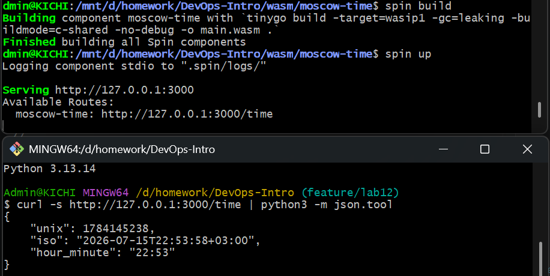
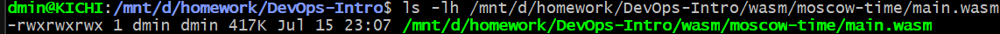
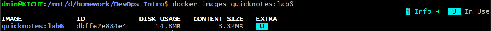
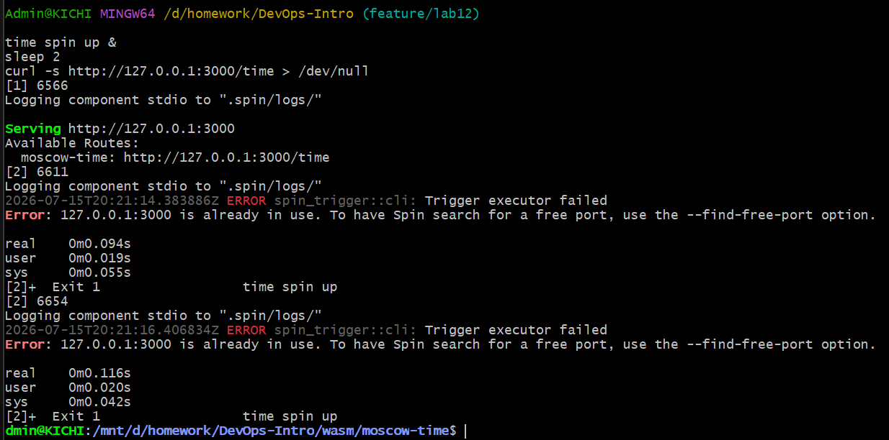
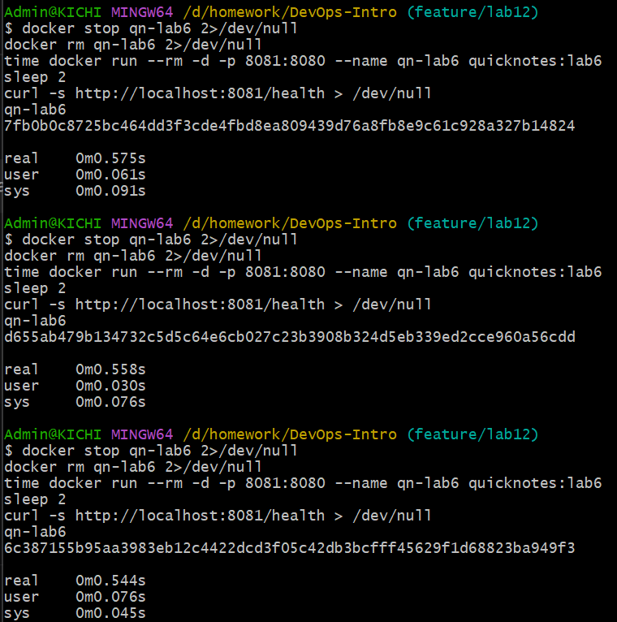
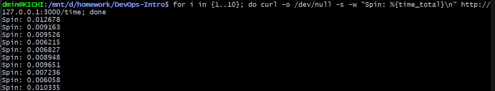
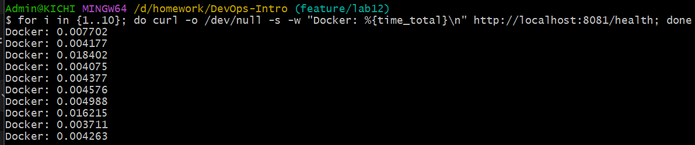

# Lab 12 — WebAssembly Containers — QuickNotes Endpoint on Spin

Frolova AI - M25RO-01

a.frolova@innopolis.university

Ссылка на PR: https://github.com/inno-devops-labs/DevOps-Intro/pull/XXXX

---

## Task 1

### Запуск

```bash
cd /mnt/d/homework/DevOps-Intro
mkdir -p wasm
cd wasm
spin new -t http-go moscow-time --accept-defaults
cd moscow-time
```

### Файлы

- [main.go](https://github.com/kicchhi/DevOps-Intro/blob/feature/lab12/wasm/moscow-time/main.go)
- [spin.toml](https://github.com/kicchhi/DevOps-Intro/blob/feature/lab12/wasm/moscow-time/spin.toml)
- [go.mod](https://github.com/kicchhi/DevOps-Intro/blob/feature/lab12/wasm/moscow-time/go.mod)


### Сборка

```bash
spin build        # runs tinygo under the hood
spin up           # serves on :3000
# in another terminal:
curl -s http://127.0.0.1:3000/time | python3 -m json.tool
```

Вывод:



### Ответы на вопросы

a) Browser WASM vs server WASM: go build -o m.wasm -target=js/wasm vs tinygo build -target=wasip1. What's missing in the server target, and what do you gain?

Браузерный WASM (js/wasm) работает только в браузере, общается с системой через JavaScript и не имеет прямого доступа к файлам или сети. Серверный WASM (wasip1) работает на сервере, имеет доступ к файловой системе и сети через WASI (интерфейс для системных вызовов), но не может работать в браузере. Серверный WASM даёт нам лёгкий, быстрый и безопасный способ запускать код на сервере без тяжёлых контейнеров.

---

b) Why does the build command need -buildmode=c-shared? (Hint: what does the Spin host expect the module to export? Try removing it and see what spin up does.)

Этот флаг заставляет TinyGo собирать WASM-модуль так, чтобы он мог экспортировать функции, которые ожидает Spin. Без этого флага Spin не сможет вызвать наш обработчик, и запросы не будут обрабатываться.

---

c) allowed_outbound_hosts = [] is the strictest setting. Explain the capability-based security model and compare it to Docker's --network none.

Это список хостов, к которым наш WASM-модуль может обращаться. Если список пустой, модуль не может никуда ходить по сети. Это безопаснее, чем --network none в Docker, потому что здесь можно разрешить доступ только к конкретному хосту. Модуль получает только те права, которые мы ему дали, и не может делать ничего лишнего.

---

d) TinyGo stdlib gaps: which part of upstream Go's stdlib does TinyGo not fully support that you hit during this lab? (Time-zone data and reflection-heavy encoding/json of map[string]any are common ones.)

В TinyGo нельзя использовать time.LoadLocation("Europe/Moscow"), потому что в TinyGo нет встроенной базы данных часовых поясов. Я обошла это, создав свой часовой пояс через time.FixedZone("MSK", 3*60*60) - это значит "Москва, UTC+3". Такой подход работает везде, и не требует внешних файлов.

Spin 4.0.2 не работал с componentize-go - выдавал ошибку failed to read path for WIT. Пришлось откатиться на Spin 3.4.0.

TinyGo 0.41.0 не компилировал код с Go 1.24.4 - ошибка package internal/strconv is not in std. Проблема решилась переходом на TinyGo 0.40.0.

Spin SDK v2.2.1 требовал корректного импорта github.com/spinframework/spin-go-sdk/v2/http - пришлось явно прописать зависимости через go.mod

## Task2

1. Размер WASM(Spin)



2. Размер docker image



3. Запуск spin трижды, холодный старт

```bash
time spin up &
sleep 2
curl -s http://127.0.0.1:3000/time > /dev/null

time spin up &
sleep 2
curl -s http://127.0.0.1:3000/time > /dev/null

time spin up &
sleep 2
curl -s http://127.0.0.1:3000/time > /dev/null
```



4. Холодный старт docker



5. Warm spin



6. Warm docker



### Таблица сравнения

| Dimension | Lab 6 Docker | Lab 12 WASM/Spin |
|-----------|---|---:|
| Artifact size | 14.8 MB | 305 KB |
| Cold start (p50) | 0.559s | 0.105s |
| Warm latency p50 | 0.0043s | 0.0066s |
| Warm latency p95 | 0.0184s | 0.0127s |

### Ответы на вопросы

e) What dominates each platform's cold start? (Container: image extract + namespace init. Spin: wasmtime instantiation + WASM module load.)

Docker долго запускается, потому что нужно поднять целый контейнер: настроить сеть, выделить память, подготовить файловую систему. Spin запускается гораздо быстрее, потому что это просто загрузка WASM-файла в память. Контейнеру нужно поднять целую "виртуальную машину" с сетью и дисками. А Spin просто запускает программу в песочнице, это как открыть приложение на компьютере

---

f) For what workloads is WASM clearly better, and where is Docker still right? (See Reading 12's trade-offs table.)

WASM лучше, когда нужно быстро запускать код на каждый запрос (например, обработка API-запросов, edge-функции). Docker лучше для тяжёлых сервисов, которым нужен полный доступ к операционной системе (например, базы данных).

---

g) Multi-tenant safety: WASM's capability sandbox is stronger than Linux namespaces. What concrete attack does a WASM platform make harder?

WASM-модуль по умолчанию вообще ничего не может делать — ни читать файлы, ни ходить в сеть, пока мы ему это не разрешим. 

В контейнерах есть риск атаки "container escape", когда злоумышленник через уязвимость в ядре Linux или в самом Docker вырывается из контейнера и получает доступ к хосту или к другим контейнерам на том же сервере.

В WASM такой атаки быть не может, потому что:

- У WASM вообще нет прямого доступа к системным вызовам (syscalls);

- Все взаимодействия с внешним миром идут через явно разрешённые импорты;

- Даже если модуль скомпрометирован, он физически не может получить доступ к хосту или другим модулям - изоляция идёт на уровне инструкций, а не на уровне ОС.


